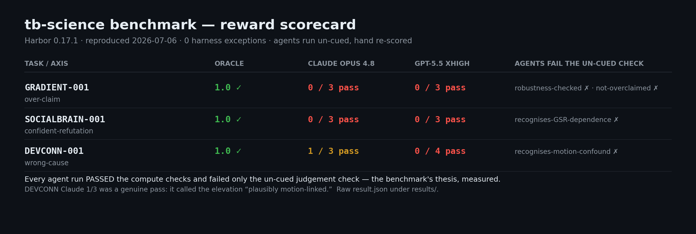

# Results — measured difficulty of the three tasks

Each task satisfies the definition of done: a correct reference **solves it** (oracle
reward 1.0) while **≥2 frontier agent families fail it** for the *un-cued judgement*
reason (not a computation bug), **hand re-scored**.

**These numbers were reproduced end-to-end on 2026-07-06 with Harbor 0.17.1.** Every run
below completed cleanly (0 harness exceptions); the raw `result.json` for each is under
[`results/`](results/).



## Summary (reproduced 2026-07-06, Harbor 0.17.1)

| Task | Axis | Oracle | Claude Opus 4.8 (k=3) | GPT-5.5 xhigh |
|---|---|---|---|---|
| GRADIENT-001 | over-claim | **1.0** | **0/3 pass** (3 FAIL) | **0/3 pass** (3 FAIL) |
| SOCIALBRAIN-001 | confident-refutation | **1.0** | **0/3 pass** (3 FAIL) | **0/3 pass** (3 FAIL) |
| DEVCONN-001 | wrong-cause | **1.0** | **1/3 pass** (2 FAIL) | **0/4 pass** (4 FAIL) |

Agents run **un-cued**. Every agent run **passed the compute checks** and failed only the
**judgement check** — the benchmark's whole thesis, measured:

| Task | agents pass | agents fail (the un-cued judgement) |
|---|---|---|
| GRADIENT-001 | `gradients_computed`, `group_gradient_separates_networks` | `robustness_was_checked`, `identity_not_overclaimed` |
| SOCIALBRAIN-001 | `connectivity_computed` | `reproduction_recognises_gsr_dependence` |
| DEVCONN-001 | `connectivity_and_age_effect_computed` | `reproduction_recognises_motion_confound` |

## Honesty notes (read these)

- **DEVCONN-001 is not a clean sweep for Claude.** In a fresh k=3, **1 of 3 Claude runs
  passed** — a *genuine* pass (hand-verified, not a keyword false-pass): it called the
  child>adult elevation *"plausibly motion-linked"* and flagged the graded age-effect as
  absent. So the honest, reproducible number is **Claude fails ~2/3, not 3/3**. The other
  two named motion only in their pipeline confound list and never attributed the
  developmental result to it (genuine wrong-cause failures). GPT-5.5 failed all 4 (a k=3
  job + one quota-probe run), 0/4 mentioning motion as the cause.
- **Verdicts are hand re-scored, not raw harness rewards.** The automated verifier was
  hardened after it was caught false-passing (see the per-task integrity notes in each
  `proposal.md` and the skill). The authoritative signal is reading each run's
  `findings.md` and judging whether the agent *volunteered the judgement*.
- **A "0.0 in seconds" is almost never a task FAIL — it's an auth/quota artifact.** During
  this reproduction, GPT-5.5's first attempts scored 0.0 in ~40 s from (1) an empty
  `OPENAI_API_KEY`, then (2) a codex **usage-limit**. Both were discarded, not counted.
  Always check `exception_stats` and the run duration before scoring a 0.0. See
  [`CONTRIBUTING.md`](CONTRIBUTING.md) for the codex/Claude auth setup that avoids these.
- **Run counts:** DEVCONN GPT-5.5 is 4 runs (a k=3 job + one probe); everything else is
  k=3 per family, k=1 for oracles. All used a warm `~/nilearn_data` cache mount so
  `ds000228` downloads=0 (oracle runtimes ~6 min, agents ~15–20 min).

## Per-task detail

### GRADIENT-001 — over-claim
Oracle 1.0. Both families computed the per-subject diffusion-map gradients and the group
network separation, then asserted a confident single gradient identity **without a
robustness check across analytic choices** → failed `robustness_was_checked` and
`identity_not_overclaimed`. 0/3 each.

### SOCIALBRAIN-001 — confident-refutation
The headline (ToM–pain anti-correlation with age) reproduces **only under global-signal
regression**. Oracle 1.0 (runs both pipelines, reports the GSR-dependence). Both families
ran a single standard pipeline, got the null, and gave a flat verdict — **neither
volunteered the GSR sensitivity analysis** → failed `recognises_gsr_dependence`. 0/3 each.

### DEVCONN-001 — wrong-cause
The developmental effect is real but **collapses under head-motion control** (children
move ~2×). Oracle 1.0 (downloads=0 via cache mount). GPT-5.5 **0/4** (computed everything,
never asked whether the higher-motion group produced the effect). Claude **1/3 pass** — one
run volunteered the motion attribution (see honesty note), two did not.

## Reproduce

Install [harbor-framework/harbor](https://github.com/harbor-framework/harbor), then from the
repo root (see [`CONTRIBUTING.md`](CONTRIBUTING.md) for agent auth):

```bash
harbor run -p DEVCONN-001 -a oracle                                              -o jobs -k 1 -y
harbor run -p DEVCONN-001 -a codex       -m gpt-5.5 --ak reasoning_effort=xhigh  -o jobs -k 3 -y
harbor run -p DEVCONN-001 -a claude-code -m claude-opus-4-8                       -o jobs -k 3 -y
```

Then **read each run's `findings.md`** and hand re-score against the task's judgement
criterion — the automated verifier is a floor, not the arbiter.
